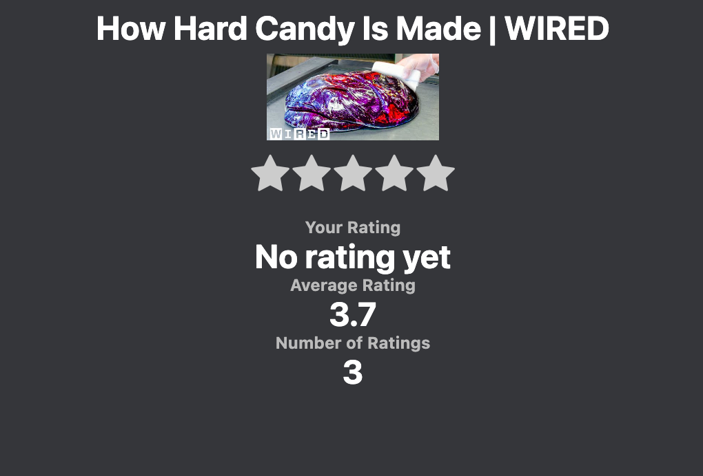

# YouRater
YouRater is my Chrome extension project that I have worked on for my summer internship. It allows for videos to be rated on a scale of 1-5 instead of Youtubes current way of doing it, which is a like count.

  
## Map
This diagram shows how the connections are made and where they take place.

